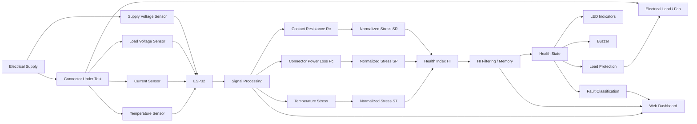

# HYBRID-ELECTRICAL-THERMAL-SIGNATURE-BASED-PROGNOSTIC-FAULT-DETECTION-IN-EV-CHARGING-INFRASTRUCTURE
An ESP32-based real-time monitoring and protection system designed to evaluate the health of an electrical connector using voltage, current, temperature, contact resistance, and connector power-loss measurements.

The system converts these electrical and thermal measurements into a unified **Health Index (HI)**. The Health Index is then used to identify normal operation, degradation, abnormal fault conditions, and critical failure.

The system also provides:

- Real-time electrical and thermal monitoring
- Contact resistance estimation
- Connector power-loss estimation
- Health Index calculation
- Degradation tracking
- Remaining-life estimation
- Fault classification
- LED-based health indication
- Buzzer-based fault indication
- Automatic load/fan disconnection during critical failure
- ESP32-hosted web dashboard
- Live monitoring of important parameters
- Serial CSV output for analysis and model validation

---

## 1. Project Overview

Electrical connectors can gradually degrade because of:

- Increased contact resistance
- Loose connections
- Electrical overload
- Heating
- Repeated electrical stress
- Mechanical wear
- Abnormal current conditions

Connector degradation can initially be difficult to detect because the system may continue operating even while electrical losses and thermal stress are increasing.

This project attempts to detect these early changes before they develop into a critical failure.

The ESP32 continuously measures:
1. Supply voltage
2. Load voltage
3. Current
4. Temperature

From these measurements, the system estimates:

- Contact resistance
- Connector power loss
- Resistance stress
- Power-loss stress
- Temperature stress
- Overall Health Index

The Health Index is filtered and used to determine the current health state of the connector.

The system operates using three primary health states:

| State | LED | Meaning |
|---|---|---|
| GREEN | Green LED | Normal / healthy |
| BLUE | Blue LED | Degradation / warning |
| RED | Red LED | Critical failure |

When a critical condition is detected, the ESP32 disconnects the load using the load-switch output.

---

# 2. System Objective

The main objective of the project is:

> To develop a low-cost embedded system capable of continuously monitoring electrical connector health, identifying abnormal operating conditions, estimating degradation, predicting remaining life, and automatically protecting the connected load during critical failure.

---

# 3. System Architecture

The complete system can be represented as follows:

4. Hardware
   
4.1 Main Controller
ESP32 Dev Module

The ESP32 is responsible for:

Sensor acquisition
Signal processing
Health Index calculation
Fault classification
State management
LED control
Buzzer control
Load protection
Wi-Fi communication
Web-server operation
Serial data logging
5. Sensors
5.1 Supply Voltage Sensor

The supply voltage is measured using an analog voltage-divider circuit.

Measured parameter:

Vs

The voltage-divider scaling factor used in the current implementation is:

divider_ratio = 3.2
5.2 Load Voltage Sensor

The load-side voltage is measured using another voltage-divider circuit.

Measured parameter:

Vl

Both supply and load voltage are used to estimate the voltage drop across the connector.

5.3 Current Sensor

The project uses an ACS712-type analog current sensor.

Current sensor parameters used in the current implementation:

ACS offset = 2.22 V
ACS sensitivity = 0.185 V/A

Current is calculated using:

I = abs((Vacs - acs_offset) / acs_sens)

where:

Vacs = measured ACS712 output voltage
acs_offset = 2.22 V
acs_sens = 0.185 V/A

Currents below:

0.05 A

are treated as zero.

5.4 Temperature Sensor

The temperature input is connected to:

PIN_TEMP = GPIO 33

The current implementation converts the ADC reading using:

Temperature = ADC_voltage × 100

This temperature conversion is therefore dependent on the analog temperature sensor used in the prototype.

6. Pin Configuration

The current ESP32 pin configuration is:

Function	ESP32 GPIO
Supply voltage	GPIO 34
Load voltage	GPIO 35
ACS712 current	GPIO 32
Temperature	GPIO 33
Green LED	GPIO 23
Blue LED	GPIO 22
Red LED	GPIO 21
Buzzer	GPIO 19
Load switch / MOSFET / relay	GPIO 18
Pin definitions
#define PIN_VSUP   34
#define PIN_VLOAD  35
#define PIN_ACS    32
#define PIN_TEMP   33

#define LED_GREEN  23
#define LED_BLUE   22
#define LED_RED    21
#define BUZZER     19
#define LOAD_SW    18
7. ADC Configuration

The current implementation uses:

ADC reference = 3.3 V
ADC resolution = 4095

Therefore:

ADC voltage = ADC reading × 3.3 / 4095

The ESP32 ADC attenuation is configured using:

ADC_11db

for all analog measurement pins.

8. Signal Sampling

Each sensor reading is averaged over:

30 samples

The sampling function uses:

samples = 30

with approximately:

150 microseconds

between individual ADC readings.

This averaging reduces short-term ADC noise.

9. Contact Resistance Calculation

The connector contact resistance is estimated using the voltage drop across the connector.

The implemented equation is:

$$ R_c = \frac{V_s-V_l}{I} $$

where:

\(R_c\) = estimated connector contact resistance
\(V_s\) = supply voltage
\(V_l\) = load voltage
\(I\) = load current

The calculation is only performed when:

I > 0.15 A

and:

Vs > Vl

The resistance is accepted only when:

0 < Rc < 120 Ω
10. Contact Resistance Filtering

Because the instantaneous resistance calculation can contain measurement noise, an exponential filter is used.

The implementation uses:

alpha = 0.5

The filtered resistance is:

$$ R_{c,avg} = \alpha R_c + (1-\alpha)R_{c,avg} $$

Therefore:

$$ R_{c,avg} = 0.5R_c + 0.5R_{c,avg} $$

This prevents individual noisy measurements from immediately dominating the Health Index.

11. Connector Power Loss

The connector power loss is calculated using:

$$ P_c=I^2R_{c,avg} $$

where:

\(P_c\) = connector power loss
\(I\) = measured current
\(R_{c,avg}\) = filtered contact resistance

The reference connector power loss used by the current model is:

Pc_ref = 8
12. Temperature Stress

The system calculates thermal stress using:

$$ T_{stress} = \frac{Temp-30}{T_{ref}} $$

where:

T_ref = 10

The resulting value is limited to:

0 ≤ Tstress ≤ 1

Therefore:

Temperature below 30°C → Tstress = 0

and increasing temperature above 30°C increases the thermal contribution to the Health Index.

13. Reference Values

The current Health Index model uses:

Rc_ref = 20
Pc_ref = 8
T_ref  = 10

These are model reference values used for normalization.

14. Normalized Stress Parameters

Three normalized stress parameters are calculated.

Resistance Stress
$$ S_R=\frac{R_{c,avg}}{R_{c,ref}} $$

with:

Rc_ref = 20
Power Stress
$$ S_P=\frac{P_c}{P_{c,ref}} $$

with:

Pc_ref = 8
Temperature Stress
$$ S_T=T_{stress} $$

The resistance and power stress values are limited to a maximum of:

1
15. No-Load Protection in the Model

When current falls below:

0.1 A

the model sets:

SR = 0
SP = 0

This prevents the Health Index from being dominated by meaningless resistance calculations when there is effectively no load current.

16. Health Index

The main output of the mathematical model is the Health Index.

The implemented weights are:

wR = 0.45
wP = 0.30
wT = 0.25

The Health Index is:

$$ HI = w_RS_R+w_PS_P+w_TS_T $$

Therefore, the current implementation is:

$$ HI = 0.45S_R + 0.30S_P + 0.25S_T $$

The three components represent:

45% → Resistance stress
30% → Power-loss stress
25% → Temperature stress
17. Health Index Filtering

To prevent rapid fluctuations, the project uses a faster intermediate Health Index.

The implementation uses:

rise_alpha = 0.3

The fast value is:

$$ HI_{fast} = 0.3HI + 0.7HI_{avg} $$

The system then compares the fast value with the stored Health Index.

If the difference is very small:

abs(fast - HI_avg) < 0.015

no update is made.

If the fast value increases:

HI_avg = fast

Otherwise, the system uses a slow decay:

HI_avg = decay × HI_avg

with:

decay = 0.99

This creates a form of Health Index inertia and prevents excessive state flickering.

18. Health State Classification

The project uses three primary states.

GREEN — Normal

Intended operating region:

HI < 0.18

The system considers this the healthy region.

BLUE — Degradation

Intended warning region:

0.18 ≤ HI < 0.27

The Blue LED indicates that the connector is no longer considered completely healthy.

The load remains ON.

RED — Critical

Critical operation is triggered by the fault latch when:

HI > 0.28

The Red LED is activated and the load is disconnected.

19. Critical Fault Latch

The system uses a fault latch so that a short critical spike does not immediately disappear.

The critical condition is:

if(!faultLatch && HI_avg > 0.28)
{
    faultLatch = true;
}

Once activated:

faultLatch = true

the system enters the critical state.

20. Fault Reset

A critical fault is not immediately cleared.

The reset condition requires:

HI < 0.18

continuously for approximately:

3 seconds

This prevents the system from rapidly switching between critical and normal states.

21. State Hold

A minimum state duration is also used.

The current implementation contains:

minStateTime = 2000 ms

or:

2 seconds

This helps prevent rapid LED/state transitions caused by small measurement fluctuations.

22. Fault Classification

In addition to the Green/Blue/Red health state, the system attempts to classify the abnormal condition.

The current fault classification order is:

Critical failure
Arc fault
Overload
Connector wear
Degradation
Normal
22.1 Critical Failure

If:

state == 2

the fault is:

CRITICAL FAILURE

This has the highest priority.

22.2 Arc Fault

The current implementation uses a trend-based inference.

The condition is:

trend > 0.025

and:

HI_avg > 0.22

If both conditions are satisfied:

ARC FAULT

is reported.

Important limitation

This project does not directly measure an electrical arc using a dedicated arc sensor.

The "ARC FAULT" classification is an inferred abnormal condition based on the Health Index trend.

Therefore, the system should be described as performing:

Trend-based arc-like fault inference

rather than direct physical arc detection.

23. Overload Detection

The project maintains a dynamic current baseline.

The current baseline update coefficient is:

I_alpha = 0.02

The baseline is updated when:

HI_avg < 0.2

The overload condition is:

I_base > 0.2 A

and:

I > 1.4 × I_base

When both conditions are satisfied:

OVERLOAD

is reported.

24. Connector Wear Detection

Connector wear is inferred using contact resistance.

The current condition is:

Rc_avg > 60 Ω

and:

I > 0.15 A

When both conditions are satisfied:

CONNECTOR WEAR

is reported.

25. Degradation Classification

If the system is in the Blue state and no higher-priority fault is detected:

DEGRADATION

is reported.

26. Normal Condition

If none of the fault conditions are detected:

NORMAL

is reported.

27. Fault Priority

The priority structure is important because multiple abnormal conditions can occur simultaneously.

The current priority is:

CRITICAL FAILURE
        ↓
ARC FAULT
        ↓
OVERLOAD
        ↓
CONNECTOR WEAR
        ↓
DEGRADATION
        ↓
NORMAL

This ensures that critical failure has priority over lower-level classifications.

28. LED Indication

The system uses three LEDs.

LED	Condition	Meaning
Green	Normal	Healthy
Blue	Degradation / non-critical fault	Warning
Red	Critical failure	Critical

The Green LED is disabled whenever a fault is detected.

The Blue LED is continuously ON during the warning state rather than blinking.

The Red LED is activated only during the critical state.

29. Buzzer Behavior

The buzzer provides an audible indication.

Normal
Buzzer OFF
Blue / Warning

The buzzer periodically turns ON using approximately:

1200 ms cycle
250 ms ON

Therefore, the warning condition produces a periodic beep.

Red / Critical
Buzzer continuously ON

This provides a clear distinction between warning and critical conditions.

30. Automatic Load Protection

The load is controlled through:

LOAD_SW = GPIO 18

The current implementation assumes:

HIGH → Load ON
LOW  → Load OFF

The load-control logic is:

digitalWrite(LOAD_SW, (state != 2));

Therefore:

GREEN  → Load ON
BLUE   → Load ON
RED    → Load OFF

This is an important safety behavior of the project.

Design principle

The fan/load is disconnected only when the system reaches the critical RED state.

31. Degradation Tracking

A cumulative degradation variable is maintained.

The current implementation updates it using:

$$ Degradation = Degradation + 0.05HI $$

per measurement loop.

The value is limited to:

100

Therefore:

Degradation ≤ 100
Important limitation

This is currently a prototype/demo degradation metric rather than a physically calibrated aging model.

It should not be interpreted as a percentage of actual connector material life without experimental calibration.

32. Remaining Life Estimation

The current implementation uses an exponential relationship:

$$ Life=120e^{-2HI} $$

where:

120

is the maximum model life scale.

For example, at approximately:

HI = 0.32

the model gives approximately:

$$ Life = 120e^{-0.64} $$

which is approximately:

63

The exact value displayed by the dashboard depends on the live Health Index.

Important limitation

The remaining-life value is currently a model-based estimate.

The value is not yet calibrated against a measured connector lifetime dataset.

A future version should calibrate the life model using experimentally collected degradation and failure data.

33. Wi-Fi Connectivity

The ESP32 hosts its own web server after connecting to the configured Wi-Fi network.

The project uses:

#include <WiFi.h>
#include <WebServer.h>

The HTTP server runs on:

Port 80

The ESP32 prints its assigned IP address to the Serial Monitor after connecting.

Example:

WiFi Connected!
192.168.x.x

The IP address can then be opened in a browser connected to the same network.

34. Web Dashboard

The ESP32 hosts a web dashboard for real-time monitoring.

The dashboard displays:

Health Index
Current
Temperature
Remaining life
Health state
Fault classification

The interface uses a dark theme.

The browser periodically requests:

/data

from the ESP32.

The ESP32 responds with JSON data.

Example structure:

{
  "HI": 0.18,
  "I": 0.19,
  "temp": 30.40,
  "life": 79.40,
  "state": "BLUE",
  "fault": "ARC FAULT"
}
35. Dashboard Data Flow
Invalid or unsupported diagram.
36. Serial Data Logging

The ESP32 also outputs a CSV-style data stream through the Serial Monitor.

The output order is:

HI,
Degradation,
Life,
Rc,
Current,
Load Voltage,
Temperature,
SR,
SP,
Tstress,
Fault

Therefore, a typical row has the structure:

HI,Degradation,Life,Rc,Current,Vl,Temp,SR,SP,Tstress,Fault

This data can be copied into a spreadsheet or data-analysis tool for:

Plotting
Model validation
Fault analysis
Trend analysis
Experimental comparison
Future machine-learning datasets
37. Complete Processing Pipeline

The complete algorithm can be summarized as:

38. Mathematical Model Summary

The complete model is:

Step 1 — Contact resistance
$$ R_c=\frac{V_s-V_l}{I} $$
Step 2 — Filtered resistance
$$ R_{c,avg} = 0.5R_c+0.5R_{c,avg} $$
Step 3 — Connector power loss
$$ P_c=I^2R_{c,avg} $$
Step 4 — Temperature stress
$$ T_{stress} = \frac{Temp-30}{10} $$

with:

$$ 0\leq T_{stress}\leq1 $$
Step 5 — Resistance stress
$$ S_R=\frac{R_{c,avg}}{20} $$
Step 6 — Power stress
$$ S_P=\frac{P_c}{8} $$
Step 7 — Temperature stress
$$ S_T=T_{stress} $$
Step 8 — Health Index
$$ HI = 0.45S_R + 0.30S_P + 0.25S_T $$
Step 9 — Fast Health Index
$$ HI_{fast} = 0.3HI+0.7HI_{avg} $$
Step 10 — Trend
$$ Trend=HI_{avg}-HI_{prev} $$
Step 11 — Degradation
$$ Degradation = Degradation+0.05HI $$
Step 12 — Remaining life
$$ Life=120e^{-2HI} $$
39. System State Flow
40. Operating Logic
Healthy Condition
Sensors
   ↓
Low electrical/thermal stress
   ↓
Low HI
   ↓
GREEN
   ↓
Green LED ON
Buzzer OFF
Load ON
Degradation Condition
Increasing stress
   ↓
HI increases
   ↓
BLUE
   ↓
Blue LED ON
Warning beep
Load remains ON
Critical Condition
High stress / critical HI
   ↓
HI > 0.28
   ↓
Critical fault latch
   ↓
RED
   ↓
Red LED ON
Continuous buzzer
Load OFF
41. Startup Behavior

During startup, the system waits for approximately:

2000 ms

before beginning the main monitoring process.

This is controlled by:

unsigned long startIgnore = 2000;

This allows the system and sensors to settle before health calculations begin.

42. Current Experimental Demonstration

The prototype demonstration follows a sequence similar to:

NORMAL
   ↓
Increasing abnormal condition
   ↓
ARC FAULT / WARNING
   ↓
CRITICAL FAILURE
   ↓
LOAD DISCONNECTED

This demonstrates the intended predictive/protective behavior of the system.

43. Example Demonstration Values

During the prototype demonstration, values approximately similar to the following were observed:

Parameter	Example observed value
Health Index	~0.32
Current	~0.62 A
Temperature	~27.7 °C
Remaining life	~62.4
Degradation	~47
Contact resistance	~2.51 Ω
State	RED
Fault	CRITICAL FAILURE

These values are example readings from the prototype demonstration and may vary depending on sensor calibration, wiring, load, and operating conditions.

44. Important Engineering Limitations

This project is currently a prototype / proof-of-concept embedded monitoring system.

The following limitations should be considered.

44.1 Contact Resistance Accuracy

The contact resistance is calculated indirectly from:

$$ R_c=\frac{V_s-V_l}{I} $$

Therefore, errors in voltage and current measurements can significantly affect the calculated resistance.

44.2 ACS712 Noise

The ACS712 is an analog Hall-effect current sensor and can produce noticeable noise, especially at low currents.

The project therefore uses multi-sample averaging.

44.3 Temperature Model

The temperature conversion currently assumes the characteristics of the analog temperature sensor used in the prototype.

A more accurate implementation should use a calibrated temperature sensor.

44.4 Arc Fault Detection

The current system does not contain a dedicated arc sensor.

The ARC FAULT classification is inferred from:

Health Index trend
+
Health Index magnitude

Therefore, it should not be described as direct arc detection.

44.5 Remaining Life

The remaining-life equation:

$$ Life=120e^{-2HI} $$

is currently a mathematical prototype model.

It requires experimental lifetime data for physical calibration.

44.6 Fault Threshold Calibration

The thresholds:

HI = 0.18
HI = 0.27
HI = 0.28
Rc = 60 Ω
I = 1.4 × I_base
Trend = 0.025

are prototype thresholds and should be validated experimentally before use in safety-critical applications.

45. Future Improvements

Several improvements can be added in future versions.

Hardware Improvements
Higher-accuracy voltage sensing
Precision resistor networks
Improved current sensor
Digital temperature sensor
Dedicated connector temperature sensor
Dedicated arc detection circuitry
Better isolation
Industrial-grade switching device
Data-logging storage
Software Improvements
Adaptive Health Index weights
Better filtering
Hysteresis for state transitions
Automatic sensor calibration
Improved overload detection
Improved connector-wear detection
Fault confidence score
Fault severity score
Event logging
Persistent historical data
Machine Learning

A future version can replace or supplement the rule-based fault classification with a machine-learning model.

Potential input features:

HI
Rc
Current
Temperature
Power loss
Trend
Voltage drop

Possible outputs:

NORMAL
OVERLOAD
CONNECTOR WEAR
ARC-LIKE FAULT
CRITICAL FAILURE

Training data can be collected from controlled experiments.

Data Logging

Future versions can store data locally using:

SPIFFS
LittleFS
SD card

A dataset could contain:

Timestamp
Vs
Vl
Current
Temperature
Rc
Rc_avg
Pc
SR
SP
Tstress
HI
Trend
Degradation
Life
Fault
State

This would allow proper statistical analysis and machine-learning development.

46. Recommended Validation Experiments

The system should be tested under controlled conditions.

Experiment 1 — Healthy Connector

Expected:

Low HI
Stable current
Stable temperature
GREEN
Load ON
Experiment 2 — Increased Contact Resistance

Expected:

Rc increases
HI increases
BLUE
Warning buzzer
Load remains ON
Experiment 3 — Overload

Expected:

Current increases
Current exceeds baseline
OVERLOAD
BLUE warning
Load remains ON unless critical HI is reached
Experiment 4 — Thermal Stress

Expected:

Temperature increases
Tstress increases
HI increases
Experiment 5 — Critical Failure

Expected:

HI > critical threshold
RED
CRITICAL FAILURE
Continuous buzzer
Load OFF

The current project is designed for:

Arduino IDE 1.8.19
ESP32 Dev Module

Required libraries:

#include <math.h>
#include <WiFi.h>
#include <WebServer.h>

The ESP32 board package must be installed in Arduino IDE.

49. How to Run
Step 1

Install:

Arduino IDE 1.8.19
Step 2

Install the ESP32 board package.

Select:

ESP32 Dev Module
Step 3

Connect the sensors and outputs according to the pin configuration.

Step 4

Update Wi-Fi credentials in the source code:

const char* ssid = "YOUR_WIFI_NAME";
const char* password = "YOUR_WIFI_PASSWORD";

Do not upload real Wi-Fi credentials to a public GitHub repository.

Step 5

Upload the firmware to the ESP32.

Step 6

Open the Serial Monitor.

Use:

115200 baud
Step 7

After Wi-Fi connection, the ESP32 prints its IP address.

Open that IP address in a browser connected to the same Wi-Fi network.

50. Project Output

The system provides three major categories of output.

Visual Output
GREEN → Healthy
BLUE  → Degradation / Warning
RED   → Critical Failure
Audible Output
GREEN → Silent
BLUE  → Periodic beep
RED   → Continuous alarm
Protection Output
GREEN → Load ON
BLUE  → Load ON
RED   → Load OFF
51. Key Features
Real-time connector monitoring
ESP32-based embedded implementation
Voltage monitoring
Current monitoring
Temperature monitoring
Contact resistance estimation
Connector power-loss calculation
Multi-parameter Health Index
Health Index filtering
Degradation estimation
Remaining-life estimation
Rule-based fault classification
Arc-like fault inference
Overload detection
Connector wear detection
Critical fault latching
Automatic load protection
LED status indication
Buzzer warning
Wi-Fi connectivity
Web dashboard
Serial CSV data output
52. Core Concept

The central idea of the project is:

$$ \boxed{ Electrical\ Stress + Thermal\ Stress + Resistance\ Degradation \rightarrow Health\ Index } $$

The Health Index provides a single numerical representation of the connector's estimated condition.

The system then converts this Health Index into an actionable protection strategy:

Healthy
   ↓
Monitor

Degrading
   ↓
Warn

Critical
   ↓
Disconnect Load
53. Project Significance

The project demonstrates how an embedded controller can combine multiple sensor measurements into a real-time condition-monitoring system.

Instead of monitoring only current or voltage, the system considers:

Voltage drop
+
Current
+
Contact resistance
+
Power loss
+
Temperature

This provides a more comprehensive representation of connector health.

The architecture can be extended toward predictive maintenance applications in:

Electrical panels
Industrial connectors
Power distribution systems
Automotive electrical systems
Battery connections
Motor connections
Industrial machinery
Smart electrical infrastructure
